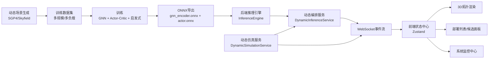

# 动态卫星场景 SFC 智能编排系统总体设计文档

## 1. 文档目的与适用范围
本文档用于完整说明当前项目的系统设计、实现边界、核心算法、数据生成、故障注入与容错机制、可视化链路、性能优化策略与验收方法。文档面向研发、测试和算法同学，目的是让团队在不依赖口头背景的情况下，能够理解并复现系统从“动态拓扑构建”到“连续编排与可视化联动”的完整闭环。

当前文档聚焦以下范围：
- 动态卫星资源感知与表征。
- 动态数据生成与训练闭环。
- 后端连续推理与在线编排。
- 前端动态拓扑与策略过程可视化。
- 故障注入、恢复与稳定性度量。
- 工程化性能优化与监控。

不覆盖范围：
- 外部协议对接（如 HTTPS/SFTP/MML/SSH 的系统级适配细节）。
- 硬件选型与部署拓扑的运维级方案。

## 2. 系统目标与核心挑战

### 2.1 业务目标
系统目标是将传统“静态拓扑 + 单次规划”的 SFC 部署方式，升级为可在动态卫星网络中持续工作的智能编排系统，形成以下闭环：

1. 动态拓扑数据持续生成（卫星位置、ISL、资源、故障事件）。
2. 训练阶段学习在动态场景下的候选排序能力。
3. 在线阶段进行会话级连续推理与必要时重调度。
4. 前端实时展示拓扑变化、策略决策过程和部署高亮。
5. 监控中心提供稳定性、故障恢复与性能全景。

### 2.2 工程挑战

1. **拓扑是时变图**：节点坐标与链路状态不断变化，静态最短路逻辑在动态环境会快速失效。
2. **编排需兼顾质量与速度**：结果要尽可能全局优，同时满足低时延（在线推理与展示刷新都有硬实时压力）。
3. **重调度代价高**：不能每次资源更新都重部署，必须建立“必要重调度”触发体系，优先保证稳定性。
4. **训练与在线口径一致性**：若训练特征与后端在线特征不一致，模型价值会显著下降。
5. **大规模可视化性能**：千星到五千星规模下，需要维持可交互、可点击、可高亮的流畅体验。

## 3. 总体架构
系统采用“前端渲染层 + 后端编排层 + 训练导出层”三层协同。

### 3.1 关键模块职责

- `backend/src/services/TopologyManager.cpp`：Walker-Delta 初始星座构建、拓扑存取。
- `backend/src/services/DynamicSimulationService.cpp`：动态推进、链路实时状态更新、故障注入与事件发布。
- `backend/src/services/InferenceEngine.cpp`：核心约束求解与模型推理融合。
- `backend/src/services/DynamicInferenceService.cpp`：会话级连续编排、必要重调度判断、决策轨迹输出。
- `frontend/src/store/useStore.ts`：统一状态中心，保存拓扑、部署、事件、监控指标。
- `frontend/src/components/UI/MonitoringPage.tsx`：系统监控中心（故障、恢复、性能、稳定性展示）。
- `train/ground_training/*`：数据生成、训练、评估、ONNX 导出。

## 4. 数据模型设计

### 4.1 动态拓扑快照（TopologySnapshot）
系统核心数据单元是按时间推进的快照，字段口径在训练与推理中保持一致：
- `sim_time`：仿真时间。
- `topology_version`：拓扑版本号。
- `sampling_interval_sec`：资源采样周期。
- `topology.nodes`：卫星节点状态（资源、位置、可靠性、故障标签）。
- `topology.links`：链路状态（时延、可用带宽、可靠性、上下线状态）。
- `metrics`：聚合指标（活跃节点/链路、拥塞链路、平均时延、带宽利用率）。
- `events`：故障/恢复事件。

该模型保证了：
1. 在线推理可直接消费快照。
2. 回放时可复现历史策略。
3. 前端可按版本绑定高亮路径，避免视觉错位。

### 4.2 部署与策略对象
部署对象包含：
- `deployed_nodes`、`per_vnf`：VNF 到节点映射和资源消耗。
- `link_details`：逐跳链路明细（时延、带宽、可靠性、状态）。
- `score_total/score_breakdown`：综合评分与分项评分。
- `satisfies_constraints/violation_details`：SLA 满足与失败原因。
- `path_recompute_count`、`decision_trigger`：动态时期行为轨迹。

### 4.3 事件流
系统通过 WebSocket 输出多类事件：
- `topology_tick`：拓扑推进。
- `decision_trace`：每次策略决策细节。
- `deployment_update`：部署状态变化。
- `fault_event` / `recovery_event`：故障与恢复。
- `metrics_tick`：监控指标。

## 5. 动态资源感知与表征设计

### 5.1 初始星座与参数化生成
后端通过 `TopologyManager` 支持按输入参数生成 Walker-Delta 星座：
- 总卫星数。
- 轨道面数。
- 轨道高度与倾角。
- 随机种子。

节点初始包含 CPU/MEM/DISK 资源与可靠性，链路包含带宽、时延与链路类型（同轨道/跨轨道）。

### 5.2 动态轨道推进与链路实时更新
`DynamicSimulationService` 在运行时按周期推进：
1. 更新卫星位置（包含经纬度与三维坐标）。
2. 基于实时距离、可见性与故障状态更新链路。
3. 重新计算链路时延与可用带宽。
4. 输出新的 `topology_version` 与 `sim_time`。

该机制确保“卫星移动—链路变化—可用路径变化”是一致联动的。

### 5.3 可配置更新参数
动态服务支持：
- `sampling_interval_sec`（1~30 秒）：资源与策略层周期。
- `simulation_speed`：仿真倍速。
- `enable_faults`、节点故障概率、链路故障概率。

前端侧还保留高频视觉更新能力，使位置变化更平滑，同时与后端版本保持对齐。

### 5.4 第三方构型适配
系统支持从外部拓扑导入并转换到统一内部模型。导入后可直接接入动态仿真与推理流程，避免“外部拓扑格式差异”导致的流程断裂。

## 6. 核心算法设计（训练 + 在线推理）

### 6.1 算法范式
当前核心算法是混合式：
- **GNN 编码器**：从全图提取节点语义表示。
- **Actor 网络**：对候选节点进行概率排序。
- **启发式剪枝**：先过滤明显不可行节点。
- **硬约束验证**：最终由后端严格检查时延、带宽、可靠性与可达性。

该设计保证“可学习 + 可解释 + 可兜底”。模型负责“更优候选顺序”，约束引擎负责“最终可行性正确性”。

### 6.2 训练输入设计
训练中使用：
- 节点特征（资源可用比、负载、可靠性、链路统计等）。
- VNF 特征（CPU/MEM/BW/DISK）。
- 上下文特征（SLA、当前 VNF 索引、剩余时延预算、拓扑动态统计、版本信息等）。

`context_dim` 与后端保持一致（默认 48），避免训练/推理口径漂移。

### 6.3 动态训练闭环
训练流程不是单快照监督，而是按时间推进的决策过程：
1. 读取动态拓扑与请求样本。
2. 每个决策步进入对应时间快照。
3. 进行候选筛选、策略选择、路径验证、资源扣减。
4. 计算奖励并更新策略。

这样训练到的是“动态环境中的连续决策能力”，而非静态一次性决策。

### 6.4 在线推理与多层兜底
后端在线推理流程：
1. 构建图输入，运行 GNN。
2. 对每个 VNF 进行剪枝与 Actor 排序。
3. 逐候选探测可行路径并校验 SLA。
4. 汇总 top-k 候选。

当模型给出的候选不足时，系统会启用兜底策略（全局扫描/保底路径）避免“有解误判无解”。因此即使未重新训练，系统仍可输出可行结果，但重训后质量和稳定性更高。

## 7. 连续编排与重调度策略

### 7.1 会话级持续编排
系统采用会话级（session）编排：
- 初始部署由用户在候选策略中选择。
- 部署后进入自动维护阶段。
- 每个拓扑周期可执行路径重算或必要重调度。

### 7.2 必要重调度原则
为了控制代价，系统优先“稳定不动”，仅在必要条件触发重调度，例如：
- 源节点故障。
- 宿节点故障。
- 已部署节点故障。
- 关键锚点间路径断连（路径不可达）。

若仅发生轻微资源波动、但当前路径仍可用，则只进行路径重算或保持原策略，不强制重部署。

### 7.3 决策轨迹可观测性
每次决策输出 `decision_trace`，包含：
- 触发原因（trigger）。
- 候选数量与可部署数量。
- 推理时延。
- 约束拒绝原因。
- 最终策略与分数。

这使“为什么重调度/为什么失败”可追溯。

## 8. 故障注入与容错恢复

### 8.1 故障注入模型
系统支持低概率稀疏故障注入：
- 节点故障概率（每周期）。
- 链路故障概率（每周期）。
- 故障持续时间（TTL）后自动恢复。

故障/恢复事件写入事件流，前端监控页实时展示。

### 8.2 恢复策略
恢复链路包含：
1. 路径重算（优先，代价最低）。
2. 局部重部署（仅对受影响段处理）。
3. 全局重调度（最后手段）。

系统监控中心提供恢复成功率、恢复时延分布、故障热力图、会话影响趋势等指标，帮助评估容错质量。

## 9. 前端可视化与交互设计

### 9.1 主页面
主页面由三部分组成：
- 3D 地球与卫星/链路实时渲染。
- 左侧星座与请求配置面板。
- 右侧部署与详情面板（支持部署查看、回滚、高亮联动）。

高亮逻辑按当前拓扑版本重算，保证已部署 SFC 的节点与链路展示与实时拓扑一致。

### 9.2 监控中心
监控页面独立于主页面，聚合展示：
- 拓扑资源健康。
- 编排性能（P95 时延、决策与失败统计）。
- 故障与恢复事件流。
- 恢复时延分布、故障热力、会话影响趋势。
- SFC 稳定性表（重调度原因、次数、稳定性评分）。

### 9.3 可用性与交互一致性
系统特别关注：
- 卫星与链路点击稳定性。
- 页面切换后交互状态恢复。
- 高亮路径实时更新且不显示失效链路。

## 10. 性能优化策略

### 10.1 后端
- 路径计算缓存与拓扑索引缓存。
- 候选池与探测上限自适应（在性能与质量间平衡）。
- 多层兜底避免重复无效搜索。
- 事件增量发布，避免全量重复传输。

### 10.2 前端
- Three.js 渲染质量分档（`high/balanced/performance`）。
- 大规模场景下动态调节 DPR、抗锯齿与星空粒子数量。
- 组件懒加载、状态分层、减少无关重渲染。
- 高亮与详情计算尽量局部化，避免全图重复计算。

### 10.3 目标指标
- 动态感知周期：默认 5 秒，可配置并受控。
- 编排算法延迟：目标在大规模场景保持低时延（关注 P95/P99）。
- 前端体验：千星级可交互，五千星级尽量保持高帧率稳定。

## 11. 数据与模型资产管理

### 11.1 训练数据
`train/data` 按训练/验证拆分，包含拓扑与请求数据，支持多规模混合，提升泛化能力。

### 11.2 模型检查点与导出
- 检查点：`models/checkpoints/*.pth`
- ONNX 导出：`models/exported/gnn_encoder.onnx`、`models/exported/actor.onnx`
- I/O 元数据：`models/exported/model_io_meta.json`

后端启动时从 `backend/config.json` 指定路径加载模型。

### 11.3 训练产物
训练与验证结果输出到 `logs/`，包括 CSV/JSON 及可视化图，支持回归对比与性能追踪。

## 12. 测试与验收建议

### 12.1 功能验收
- 动态拓扑是否连续更新，链路是否随位置重算。
- 候选策略是否可选择、可部署、可回滚。
- 部署后高亮是否与当前拓扑一致。
- 故障触发后是否按必要条件进行重调度。

### 12.2 性能验收
- 1000、2500、4000、5000+ 节点分层压测。
- 后端推理时延统计（P50/P95/P99）。
- 前端 FPS 与交互延迟统计。

### 12.3 稳定性验收
- 长时运行（如 2 小时）观察内存、事件延迟、状态一致性。
- 固定随机种子回放场景，验证结果可复现。

## 13. 已知边界与后续演进方向

### 13.1 已知边界
- 当前链路建立逻辑以工程可用为主，仍可继续向更高保真轨道通信模型扩展。
- 在极端拥塞与高故障叠加场景下，推理速度与策略质量仍需持续优化。

### 13.2 演进方向
1. 引入更强的时序编码结构（如显式时间窗口编码或图时序网络）提升动态预测能力。
2. 建立离线回放评测集，形成版本化基线。
3. 扩展故障类型（软故障、间歇故障、区域性故障）与恢复策略库。
4. 持续优化大规模渲染策略，提升 5000+ 节点下的稳定帧率。

## 14. 结论
本系统已经形成动态卫星场景下 SFC 编排的完整工程闭环：
- 能持续生成并消费动态拓扑；
- 能在会话级进行连续推理和必要重调度；
- 能在前端准确展示动态拓扑与部署策略；
- 能通过监控中心对故障恢复与稳定性进行量化评估。

下一步工作重点应放在“更高保真的链路模型 + 更强时序策略 + 更高规模性能稳定性”三条主线上，持续提升实战可用性与可解释性。
